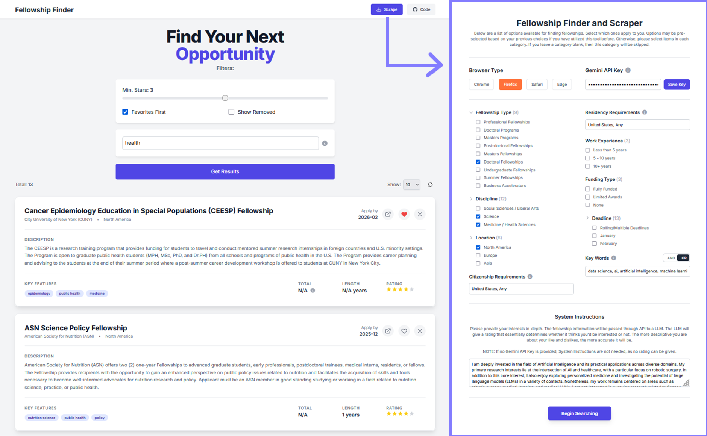

<div align="center">
# Fellowship Finder

Fellowship Finder is a web scraping and data management application designed to help users discover and organize fellowship opportunities from ProFellow.com. Further operations will be added in the future, such as pulling from private resources, job boards, and other large platforms.
</div>

## Core Purpose

Fellowship Finder is designed to:

- **Automate Discovery**: Streamline the process of finding fellowship opportunities through advanced web scraping.
- **User-Friendly Management**: Offer an intuitive interface for organizing and managing fellowship data.
- **Enhanced Organization**: Enable features like favoriting, removal, and categorization of opportunities.
- **AI-Powered Refinement**: Leverage artificial intelligence to refine and improve the quality of scraped data.


## Visual Interface

<div align="center">
    
</div>


## Technology Stack
- **Backend**: Flask, Selenium, Pandas, Google Generative AI
- **Frontend**: Jinja2, Tailwind CSS, Vanilla JavaScript
- **Storage**: CSV and JSON files

## Common Commands
### Setup
#### UV Set-Up
```bash
# Install dependencies
uv sync  # Preferred
pip install -r requirements.txt  # Fallback
uv run main.py
```

#### Conda Set-Up
```bash
# Install dependencies
conda create -n fellowship python=3.10
conda activate fellowship
python app.py
```

### Data Operations
```bash
python data_retrieval.py --browser firefox  # Scrape with browser
python data_retrieval.py --refine  # Process raw data
python data_retrieval.py --cleartmp  # Clean temporary files
python data_retrieval.py --cleanup  # Full cleanup
python data_retrieval.py --notify-app  # Scrape and notify app
```

## Project Structure

```
Fellowship-Finder/
├── app.py                 # Main Flask application
├── data_retrieval.py      # Web scraping and data processing CLI
├── config.ini             # Path configurations
├── requirements.txt       # Dependencies
├── pyproject.toml         # Project configuration
├── configs/               # Configuration files
│   ├── filters.json       # Scraping filters
│   ├── api_key.json       # Google Gemini API key
│   └── login.json         # ProFellow.com credentials (excluded from repo)
├── data/                  # Data directories
│   ├── raw/               # Raw scraped data
│   └── processed/         # Refined data
├── tmp/                   # Temporary files
├── templates/             # Web interface templates
│   ├── index.html
│   └── scrape.html
├── static/                # Static assets (CSS, JS, icons)
├── utils/                 # Core logic
│   ├── data_manager.py    # CSV operations and filtering
│   ├── scrape.py          # Selenium-based scraper
│   ├── data.py            # Raw data processing
│   ├── refinement.py      # AI-powered data refinement
│   └── files_folders.py   # File and directory management
```
